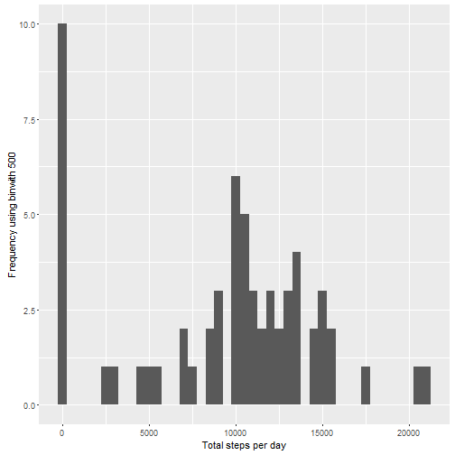

# Reproducible Research Project 1 


## Loading and preprocessing the data
##### 1. Load the data (i.e. read.csv())

```r
if(!file.exists('activity.csv')){
    unzip('activity.zip')
}
activityData <- read.csv('activity.csv')
```
##### 2. Process/transform the data (if necessary) into a format suitable for your analysis

```r
#activityData$interval <- strptime(gsub("([0-9]{1,2})([0-9]{2})", "\\1:\\2", activityData$interval), format='%H:%M')
```

-----

## What is mean total number of steps taken per day?

```r
stepsByDay <- tapply(activityData$steps, activityData$date, sum, na.rm=TRUE)
```

##### 1. Make a histogram of the total number of steps taken each day

```r
qplot(stepsByDay, xlab='Total steps per day', ylab='Frequency using binwith 500', binwidth=500)
```



##### 2. Calculate and report the mean and median total number of steps taken per day

```r
stepsByDayMean <- mean(stepsByDay)
stepsByDayMedian <- median(stepsByDay)
```
* Mean: 9354.2295082
* Median:  10395

-----

## What is the average daily activity pattern?

```r
averageStepsPerTimeBlock <- aggregate(x=list(meanSteps=activityData$steps), by=list(interval=activityData$interval), FUN=mean, na.rm=TRUE)
```

##### 1. Make a time series plot

```r
ggplot(data=averageStepsPerTimeBlock, aes(x=interval, y=meanSteps)) +
    geom_line() +
    xlab("5-minute interval") +
    ylab("average number of steps taken") 
```


##### 2. Which 5-minute interval, on average across all the days in the dataset, contains the maximum number of steps?

```r
mostSteps <- which.max(averageStepsPerTimeBlock$meanSteps)
timeMostSteps <-  gsub("([0-9]{1,2})([0-9]{2})", "\\1:\\2", averageStepsPerTimeBlock[mostSteps,'interval'])
```
